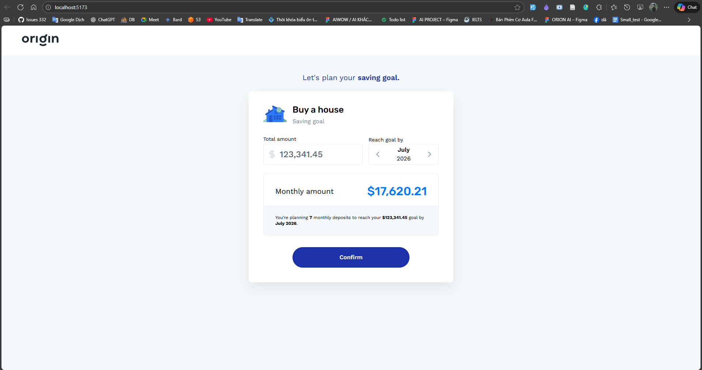
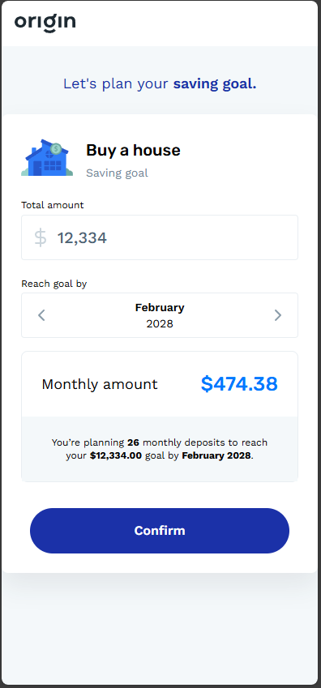

# Savings Goal

This project implements a **Savings Goal** screen using Vue 3, TypeScript, Pinia, and Tailwind CSS. Users can simulate saving towards a goal like "Buy a house" by entering the total amount and target date. The app calculates the required monthly deposits and shows a summary.

## Features

- Enter total savings amount with number-only input.
- Select target month/year (default to next month).
- Automatic calculation of monthly deposit amount.
- Display summary of planned deposits.
- Responsive layout with Tailwind CSS.

## Tech Stack

- Vue 3 + `<script setup>`
- TypeScript
- Vite
- Tailwind CSS v4
- Pinia for state management

## Project Structure

```
src/
├─ assets/ # Static files like SVGs
├─ components/ # Vue components
├─ layouts/ # Layouts (header, footer, default layout)
├─ stores/ # Pinia stores
├─ types/ # TypeScript interfaces
├─ utils/ # Utility functions (price, date)
└─ App.vue
```

## Setup & Run

1. Clone the repo:

```bash
git clone https://github.com/Khangtt1110/saving-goal.git
cd saving-goal
```

2. Install dependencies:

```
yarn install
or
npm install
```

3. Run development server:

```
yarn dev
or
npm run dev
```

4. Build for production:

```
yarn build
or
npm run build
```

DEMO:


